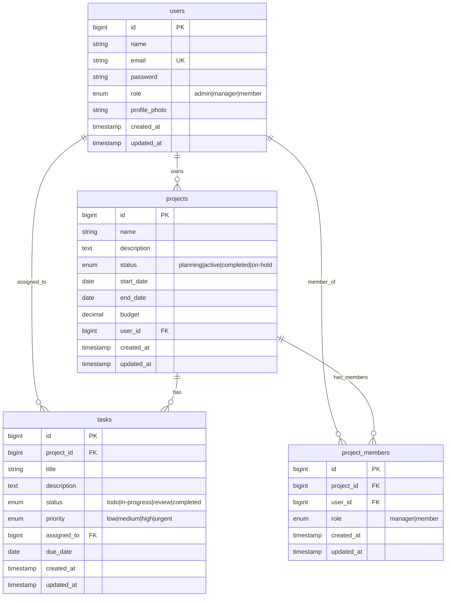
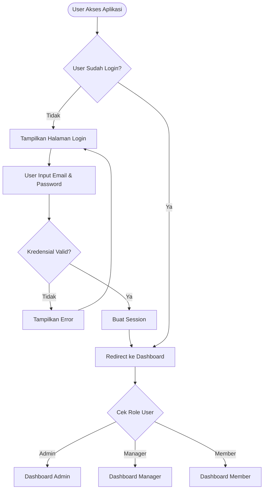
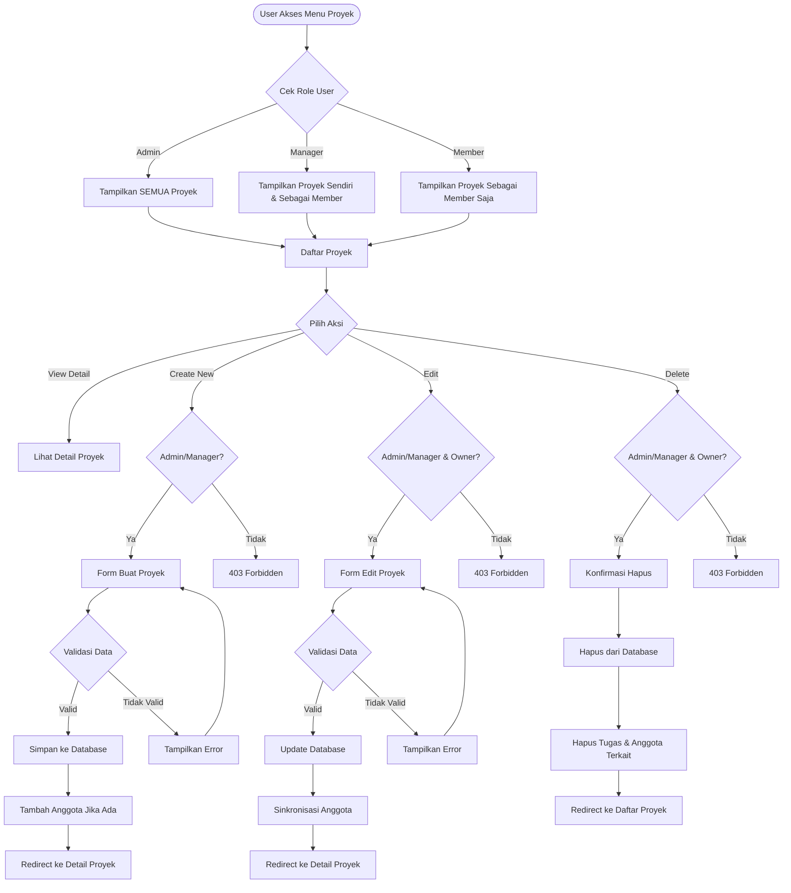
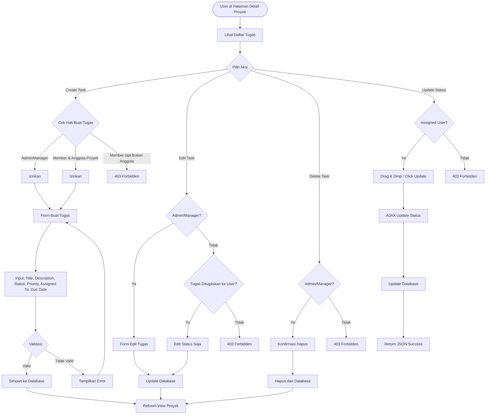
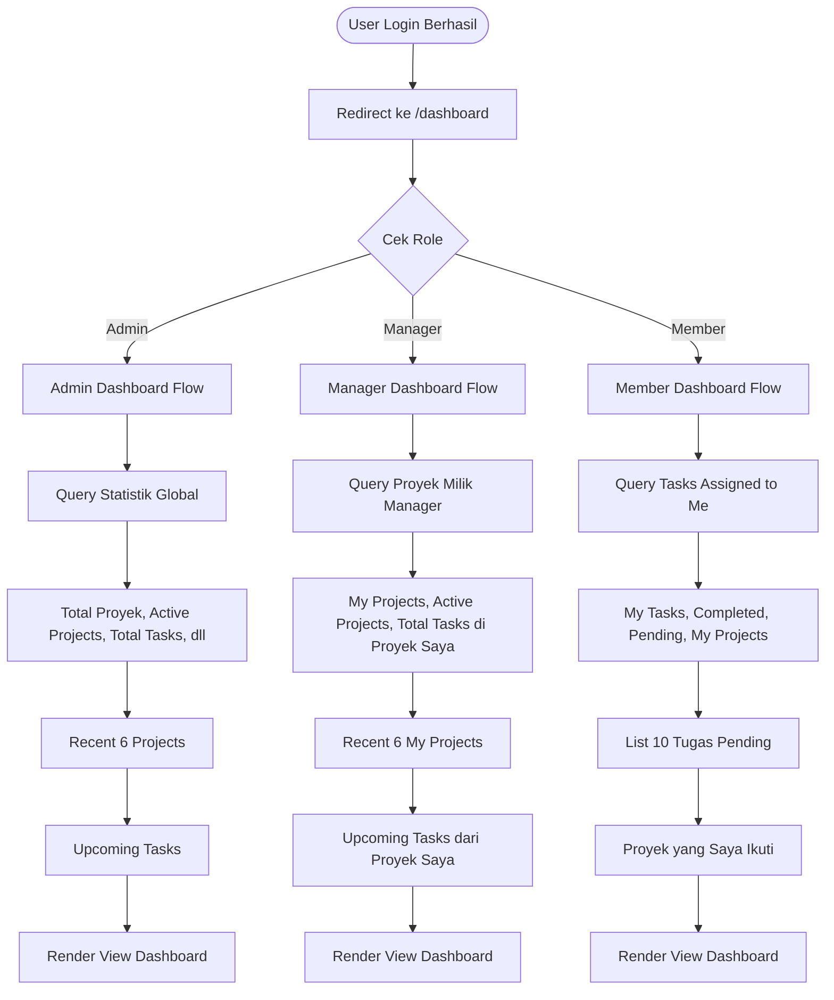

# Dokumentasi Aplikasi Sistem Manajemen Proyek

## 📌 Ringkasan Aplikasi

**Sistem Manajemen Proyek** adalah aplikasi berbasis web yang dibangun menggunakan **Laravel 10** dengan tujuan memfasilitasi pengelolaan proyek dan tugas secara kolaboratif. Aplikasi ini memiliki sistem autentikasi berbasis peran (Role-Based Access Control) yang membedakan hak akses untuk **Admin**, **Manager**, dan **Member**.

### Tujuan Aplikasi
- Mengelola proyek dengan informasi lengkap (nama, deskripsi, status, tanggal, budget)
- Mengelola tugas dalam setiap proyek dengan sistem prioritas dan status
- Memberikan dashboard yang berbeda sesuai peran pengguna
- Memfasilitasi kolaborasi tim dengan sistem keanggotaan proyek
- Tracking progress proyek dan tugas secara real-time

---

## 🎯 Fitur Utama

### 1. **Autentikasi & Otorisasi**
- Register dan Login user
- Role-based access control (Admin, Manager, Member)
- Profile management dengan foto profil

### 2. **Manajemen Proyek**
- CRUD (Create, Read, Update, Delete) proyek
- Filter dan pencarian proyek
- Status proyek: Planning, Active, Completed, On-Hold
- Budget tracking
- Progress tracking otomatis berdasarkan task completion
- Manajemen anggota tim per proyek

### 3. **Manajemen Tugas**
- CRUD tugas dengan berbagai status
- 4 tingkat prioritas: Low, Medium, High, Urgent
- 4 status tugas: Todo, In-Progress, Review, Completed
- Assign tugas ke anggota tim
- Due date tracking
- Drag & drop untuk update status (Kanban-style)

### 4. **Dashboard Role-Based**
- Admin: Statistik sistem secara keseluruhan
- Manager: Statistik proyek yang dikelola
- Member: Statistik tugas yang ditugaskan

---

## 👥 Peran Pengguna (User Roles)

### 🔴 Admin
**Hak Akses Penuh:**
- Melihat SEMUA proyek dan tugas di sistem
- Membuat, mengedit, dan menghapus proyek
- Membuat, mengedit, dan menghapus tugas
- Mengelola anggota proyek
- Akses ke dashboard dengan statistik global

### 🟡 Manager
**Hak Akses Terbatas:**
- Melihat proyek yang dibuat sendiri + proyek yang menjadi anggota
- Membuat proyek baru
- Mengedit dan menghapus proyek sendiri
- Membuat, mengedit, dan menghapus tugas di proyek sendiri
- Mengelola anggota di proyek sendiri
- Dashboard menampilkan statistik proyek yang dikelola

### 🟢 Member
**Hak Akses Minimal:**
- Melihat proyek yang menjadi anggota
- Membuat tugas di proyek yang menjadi anggota (fitur baru!)
- Update status tugas yang ditugaskan ke diri sendiri
- TIDAK BISA edit/delete tugas
- TIDAK BISA buat/edit/delete proyek
- Dashboard menampilkan tugas yang ditugaskan

---

## 🗄️ Struktur Database

### ERD (Entity Relationship Diagram)



### Tabel Database

#### 1. **users** - Tabel Pengguna
| Kolom | Tipe | Deskripsi |
|-------|------|-----------|
| `id` | BIGINT (PK) | ID unik pengguna |
| `name` | VARCHAR(255) | Nama lengkap pengguna |
| `email` | VARCHAR(255) UNIQUE | Email (untuk login) |
| `password` | VARCHAR(255) | Password terenkripsi |
| `role` | ENUM | Peran: 'admin', 'manager', 'member' (default: member) |
| `profile_photo` | VARCHAR(255) | Path foto profil |
| `created_at` | TIMESTAMP | Waktu pembuatan |
| `updated_at` | TIMESTAMP | Waktu update terakhir |

**Relasi:**
- `hasMany` → projects (sebagai owner)
- `hasMany` → tasks (sebagai assigned user)
- `belongsToMany` → projects (melalui project_members, sebagai member)

---

#### 2. **projects** - Tabel Proyek
| Kolom | Tipe | Deskripsi |
|-------|------|-----------|
| `id` | BIGINT (PK) | ID unik proyek |
| `name` | VARCHAR(255) | Nama proyek |
| `description` | TEXT | Deskripsi detail proyek |
| `status` | ENUM | Status: 'planning', 'active', 'completed', 'on-hold' (default: planning) |
| `start_date` | DATE | Tanggal mulai proyek |
| `end_date` | DATE | Tanggal selesai/deadline |
| `budget` | DECIMAL(12,2) | Anggaran proyek |
| `user_id` | BIGINT (FK) | ID owner/pembuat proyek |
| `created_at` | TIMESTAMP | Waktu pembuatan |
| `updated_at` | TIMESTAMP | Waktu update terakhir |

**Relasi:**
- `belongsTo` → users (sebagai owner)
- `hasMany` → tasks
- `belongsToMany` → users (melalui project_members, sebagai members)

**Constraint:**
- `user_id` → CASCADE on delete (jika user dihapus, proyek ikut terhapus)

---

#### 3. **tasks** - Tabel Tugas
| Kolom | Tipe | Deskripsi |
|-------|------|-----------|
| `id` | BIGINT (PK) | ID unik tugas |
| `project_id` | BIGINT (FK) | ID proyek induk |
| `title` | VARCHAR(255) | Judul tugas |
| `description` | TEXT | Deskripsi detail tugas |
| `status` | ENUM | Status: 'todo', 'in-progress', 'review', 'completed' (default: todo) |
| `priority` | ENUM | Prioritas: 'low', 'medium', 'high', 'urgent' (default: medium) |
| `assigned_to` | BIGINT (FK) | ID user yang ditugaskan |
| `due_date` | DATE | Tanggal deadline |
| `created_at` | TIMESTAMP | Waktu pembuatan |
| `updated_at` | TIMESTAMP | Waktu update terakhir |

**Relasi:**
- `belongsTo` → projects
- `belongsTo` → users (sebagai assigned user)

**Constraint:**
- `project_id` → CASCADE on delete (jika proyek dihapus, tugas ikut terhapus)
- `assigned_to` → SET NULL on delete (jika user dihapus, tugas tetap ada tapi tidak assigned)

---

#### 4. **project_members** - Tabel Pivot Anggota Proyek
| Kolom | Tipe | Deskripsi |
|-------|------|-----------|
| `id` | BIGINT (PK) | ID unik |
| `project_id` | BIGINT (FK) | ID proyek |
| `user_id` | BIGINT (FK) | ID user anggota |
| `role` | ENUM | Peran di proyek: 'manager', 'member' (default: member) |
| `created_at` | TIMESTAMP | Waktu bergabung |
| `updated_at` | TIMESTAMP | Waktu update terakhir |

**Unique Index:** `project_id` + `user_id` (satu user hanya bisa sekali masuk ke proyek yang sama)

**Constraint:**
- `project_id` → CASCADE on delete
- `user_id` → CASCADE on delete

---

## 🔄 Alur Sistem (System Flow)

### 1️⃣ Alur Autentikasi



**Penjelasan:**
1. User mengakses aplikasi
2. Middleware `auth` memeriksa status login
3. Jika belum login → redirect ke halaman login
4. User input email & password
5. Laravel Auth memvalidasi kredensial
6. Jika valid → buat session & redirect ke dashboard
7. Dashboard ditampilkan sesuai role user

---

### 2️⃣ Alur Manajemen Proyek



**Penjelasan Detail:**

#### **VIEW (Melihat Proyek)**
1. User akses menu proyek
2. System cek role:
   - **Admin**: Query semua proyek tanpa filter
   - **Manager**: Query proyek WHERE (user_id = current_user OR user IN project_members)
   - **Member**: Query proyek WHERE user IN project_members
3. Tampilkan hasil dengan pagination (12 item/halaman)

#### **CREATE (Membuat Proyek)**
1. User klik tombol "Buat Proyek"
2. Middleware `role:admin,manager` memeriksa hak akses
3. Jika tidak punya akses → 403 Forbidden
4. Jika punya akses → tampilkan form
5. User isi form (nama, deskripsi, status, tanggal, budget, anggota)
6. Submit form → validasi di backend
7. Jika valid:
   - Simpan data proyek ke tabel `projects`
   - Simpan relasi anggota ke tabel `project_members`
   - Redirect ke halaman detail proyek
8. Jika tidak valid → tampilkan error

#### **UPDATE (Mengedit Proyek)**
1. Sama seperti CREATE, tapi ada pengecekan ownership
2. Authorization: `$this->authorize('update', $project)`
3. Policy memeriksa: Admin ATAU (Manager/Owner && user_id == project.user_id)
4. Update data menggunakan Eloquent
5. Sync anggota proyek (hapus yang tidak dipilih, tambah yang baru)

#### **DELETE (Menghapus Proyek)**
1. Authorization sama seperti UPDATE
2. Cascade delete otomatis menghapus:
   - Semua tugas di proyek (karena FK constraint)
   - Semua relasi di project_members
3. Redirect ke daftar proyek

---

### 3️⃣ Alur Manajemen Tugas



**Penjelasan Detail:**

#### **CREATE TASK (Membuat Tugas)**
**Fitur Baru yang Ditambahkan:**

Sebelumnya, hanya Admin dan Manager yang bisa membuat tugas. Sekarang **Member yang merupakan anggota proyek juga bisa membuat tugas!**

**Logika Authorization:**
```php
// Di TaskController@store
if (!$user->isAdmin() && !$user->isManager()) {
    // Cek apakah user adalah member dari proyek ini
    $isMember = $project->members()->where('user_id', $user->id)->exists();
    $isOwner = $project->user_id === $user->id;
    
    if (!$isMember && !$isOwner) {
        abort(403, 'You must be a member of this project to create tasks.');
    }
}
```

**Alur:**
1. User klik "Buat Tugas" di halaman detail proyek
2. System cek:
   - Jika Admin/Manager → langsung izinkan
   - Jika Member → cek apakah ada di `project_members` untuk proyek ini
3. Jika punya akses → tampilkan modal/form
4. User isi form → submit
5. Validasi data
6. Simpan ke database dengan `project_id` otomatis
7. Return response (JSON jika AJAX, redirect jika form biasa)

#### **UPDATE TASK (Mengedit Tugas)**
Ada 2 skenario:

**Skenario 1: Admin/Manager**
- Bisa edit semua field: title, description, status, priority, assigned_to, due_date

**Skenario 2: Member**
- Hanya bisa edit **status** dari tugas yang ditugaskan ke diri sendiri
- Validasi: `$task->assigned_to === Auth::id()`

#### **DELETE TASK (Menghapus Tugas)**
- Hanya Admin dan Manager
- Menggunakan policy authorization

#### **UPDATE STATUS (Drag & Drop)**
- Semua user bisa update status tugas yang ditugaskan ke mereka
- Menggunakan AJAX untuk real-time update
- Endpoint: `POST /tasks/{task}/status`

---

### 4️⃣ Alur Dashboard



**Penjelasan:**

#### **Admin Dashboard**
```php
// Query yang dijalankan
$stats = [
    'total_projects' => Project::count(),
    'active_projects' => Project::where('status', 'active')->count(),
    'total_tasks' => Task::count(),
    'completed_tasks' => Task::where('status', 'completed')->count(),
    'total_users' => User::count(),
    'pending_tasks' => Task::whereIn('status', ['todo', 'in-progress'])->count(),
];

$recentProjects = Project::with('owner', 'tasks')->latest()->take(6)->get();
$upcomingTasks = Task::with('project', 'assignedUser')
    ->whereNotIn('status', ['completed'])
    ->orderBy('due_date', 'asc')
    ->take(5)
    ->get();
```

#### **Manager Dashboard**
```php
// Query hanya untuk proyek yang dimiliki manager
$stats = [
    'my_projects' => $user->projects()->count(),
    'active_projects' => $user->projects()->where('status', 'active')->count(),
    'total_tasks' => Task::whereHas('project', function($query) use ($user) {
        $query->where('user_id', $user->id);
    })->count(),
    // dst...
];
```

#### **Member Dashboard**
```php
// Query hanya untuk tugas yang assigned ke member
$stats = [
    'my_tasks' => $user->tasks()->count(),
    'completed_tasks' => $user->tasks()->where('status', 'completed')->count(),
    'pending_tasks' => $user->tasks()->whereIn('status', ['todo', 'in-progress'])->count(),
    'my_projects' => $user->assignedProjects()->count(),
];

$myTasks = $user->tasks()
    ->with('project')
    ->whereNotIn('status', ['completed'])
    ->orderBy('due_date', 'asc')
    ->take(10)
    ->get();
```

---

## 🔐 Authorization & Policy

### Middleware yang Digunakan

#### 1. **auth** - Middleware Autentikasi
```php
Route::middleware(['auth'])->group(function () {
    // Semua route yang butuh login
});
```

#### 2. **role:admin,manager** - Middleware Role
```php
// File: app/Http/Middleware/RoleMiddleware.php (custom)
Route::middleware(['role:admin,manager'])->group(function () {
    // Route khusus admin dan manager
});
```

### Policy Authorization

Laravel menggunakan Policy untuk authorization yang lebih kompleks:

```php
// File: app/Policies/ProjectPolicy.php

public function view(User $user, Project $project)
{
    // Admin bisa lihat semua
    if ($user->isAdmin()) return true;
    
    // Manager bisa lihat proyek sendiri atau yang jadi member
    if ($user->isManager() && ($project->user_id === $user->id || $project->members->contains($user))) {
        return true;
    }
    
    // Member hanya bisa lihat proyek yang jadi member
    return $project->members->contains($user);
}

public function update(User $user, Project $project)
{
    // Hanya admin atau owner proyek
    return $user->isAdmin() || $project->user_id === $user->id;
}
```

---

## 📊 Fitur Tracking & Statistik

### Progress Tracking Otomatis

**Perhitungan Progress Proyek:**
```php
// Di Model Project
public function getProgressAttribute(): int
{
    $totalTasks = $this->tasks->count();
    
    if ($totalTasks === 0) {
        return 0;
    }

    $completedTasks = $this->tasks->where('status', 'completed')->count();
    
    return (int) round(($completedTasks / $totalTasks) * 100);
}
```

**Cara Menggunakan:**
```php
$project = Project::with('tasks')->find(1);
$progress = $project->progress; // Otomatis return persentase (misal: 75)
```

### Overdue Detection

**Deteksi Tugas Terlambat:**
```php
// Di Model Task
public function scopeOverdue($query)
{
    return $query->where('due_date', '<', now())
                ->whereNotIn('status', ['completed']);
}

// Cara pakai:
$overdueTasks = Task::overdue()->get();
```

---

## 🎨 Fitur UI/UX

### Kanban Board
- Drag & drop task antar kolom status
- Real-time update menggunakan AJAX
- Visual feedback saat drag

### Color Coding

**Priority Colors:**
- 🔴 Urgent → Red
- 🟠 High → Orange
- 🟡 Medium → Yellow
- 🟢 Low → Green

**Status Colors:**
- ⚫ Todo → Gray
- 🟣 In-Progress → Purple
- 🔵 Review → Blue
- 🟢 Completed → Green

### Responsive Design
- Mobile-friendly
- Glassmorphism effects
- Dark mode support (jika sudah diimplementasi)

---

## 🚀 Deployment & Setup

### Requirements
- PHP >= 8.1
- Composer
- MySQL/MariaDB
- Node.js & NPM

### Installation Steps

```bash
# 1. Clone repository
git clone <repository-url>
cd sistem-project10/laravel

# 2. Install dependencies
composer install
npm install

# 3. Setup environment
cp .env.example .env
php artisan key:generate

# 4. Konfigurasi database di .env
DB_CONNECTION=mysql
DB_HOST=127.0.0.1
DB_PORT=3306
DB_DATABASE=project_management
DB_USERNAME=root
DB_PASSWORD=

# 5. Migrate database
php artisan migrate

# 6. (Optional) Seed data dummy
php artisan db:seed

# 7. Build assets
npm run dev

# 8. Run application
php artisan serve
```

Aplikasi akan berjalan di `http://localhost:8000`

---

## 📝 Catatan Penting

### Cascade Delete
- **Jika User dihapus**: Semua proyek miliknya akan terhapus
- **Jika Proyek dihapus**: Semua tugas & anggota proyek akan terhapus
- **Jika User ditugaskan di Task, lalu User dihapus**: Field `assigned_to` akan menjadi NULL (tidak delete task)

### Business Logic Constraints
1. End date proyek harus >= start date
2. Satu user hanya bisa masuk sekali ke proyek yang sama (UNIQUE constraint)
3. Member hanya bisa update status tugas yang ditugaskan ke mereka
4. Creator proyek otomatis punya full access tanpa perlu masuk project_members

### Security
- Password di-hash menggunakan bcrypt
- CSRF protection otomatis dengan Laravel
- SQL Injection prevention dengan Eloquent ORM
- XSS protection dengan Blade templating

---

## 🔄 Update Terbaru

### Latest Feature: Member Can Create Tasks
Sebelumnya hanya Admin dan Manager yang bisa membuat task. Sekarang **Member yang tergabung dalam proyek juga bisa membuat task**.

**Perubahan:**
- Route `tasks.store` tidak lagi menggunakan middleware `role:admin,manager`
- Authorization dipindah ke controller dengan logika custom
- Member yang bukan anggota proyek tetap tidak bisa buat task (403 Forbidden)

**File yang Diubah:**
- [`routes/web.php`](file:///b:/sistem-project10/laravel/routes/web.php)
- [`app/Http/Controllers/TaskController.php`](file:///b:/sistem-project10/laravel/app/Http/Controllers/TaskController.php)

---

## 📚 Referensi Kode Penting

### Models
- [`User.php`](file:///b:/sistem-project10/laravel/app/Models/User.php) - Model pengguna dengan helper methods (isAdmin, isManager, dll)
- [`Project.php`](file:///b:/sistem-project10/laravel/app/Models/Project.php) - Model proyek dengan progress tracking
- [`Task.php`](file:///b:/sistem-project10/laravel/app/Models/Task.php) - Model tugas dengan scope overdue

### Controllers
- [`DashboardController.php`](file:///b:/sistem-project10/laravel/app/Http/Controllers/DashboardController.php) - Logic dashboard role-based
- [`ProjectController.php`](file:///b:/sistem-project10/laravel/app/Http/Controllers/ProjectController.php) - CRUD proyek dengan authorization
- [`TaskController.php`](file:///b:/sistem-project10/laravel/app/Http/Controllers/TaskController.php) - CRUD tugas dengan custom authorization

### Migrations
- [`2025_01_01_000001_add_role_to_users_table.php`](file:///b:/sistem-project10/laravel/database/migrations/2025_01_01_000001_add_role_to_users_table.php)
- [`2025_01_01_000002_create_projects_table.php`](file:///b:/sistem-project10/laravel/database/migrations/2025_01_01_000002_create_projects_table.php)
- [`2025_01_01_000003_create_tasks_table.php`](file:///b:/sistem-project10/laravel/database/migrations/2025_01_01_000003_create_tasks_table.php)
- [`2025_01_01_000004_create_project_members_table.php`](file:///b:/sistem-project10/laravel/database/migrations/2025_01_01_000004_create_project_members_table.php)

---

## 🎯 Future Improvements

### Planned Features
- [ ] Real-time notifications menggunakan WebSocket
- [ ] Activity log/history
- [ ] File attachment untuk tugas
- [ ] Comment system untuk tugas
- [ ] Time tracking untuk tugas
- [ ] Export report (PDF/Excel)
- [ ] Email notifications
- [ ] Calendar view untuk deadline
- [ ] Advanced search & filtering

---

## 👨‍💻 Developer Notes

### Teknologi yang Digunakan
- **Backend**: Laravel 10
- **Frontend**: Blade Templates, TailwindCSS, Alpine.js
- **Database**: MySQL
- **Build Tool**: Vite
- **Authentication**: Laravel Breeze/Custom

### Struktur Folder
```
laravel/
├── app/
│   ├── Http/
│   │   ├── Controllers/
│   │   └── Middleware/
│   ├── Models/
│   └── Policies/
├── database/
│   ├── migrations/
│   └── seeders/
├── resources/
│   ├── views/
│   └── css/
├── routes/
│   └── web.php
└── tests/
```

---

**Dokumentasi ini dibuat pada: 6 Januari 2026**

Untuk pertanyaan atau saran, silakan hubungi tim pengembang.

