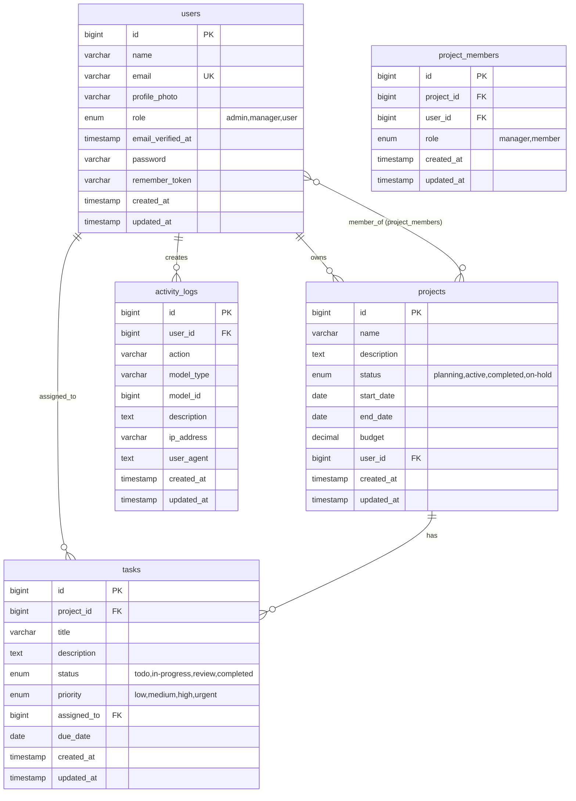
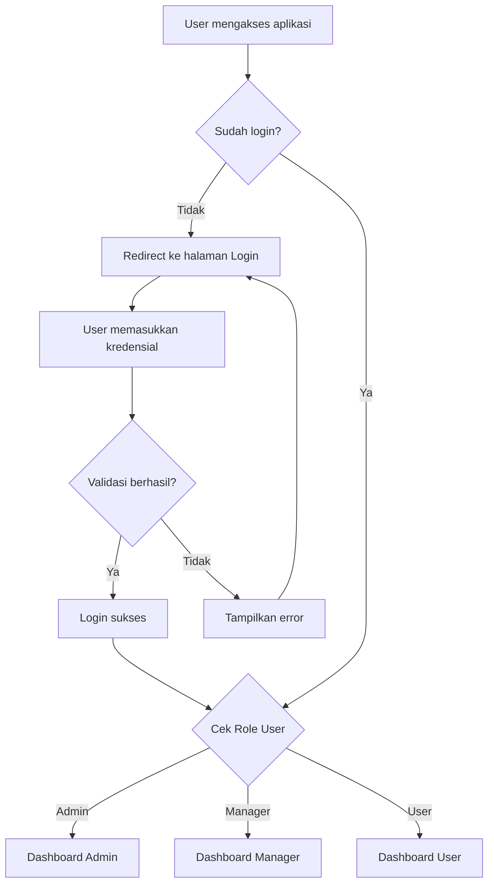
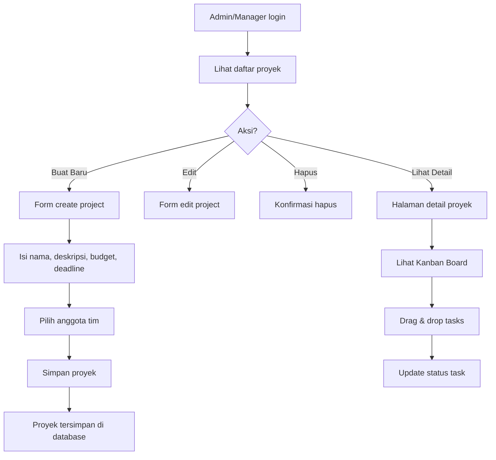
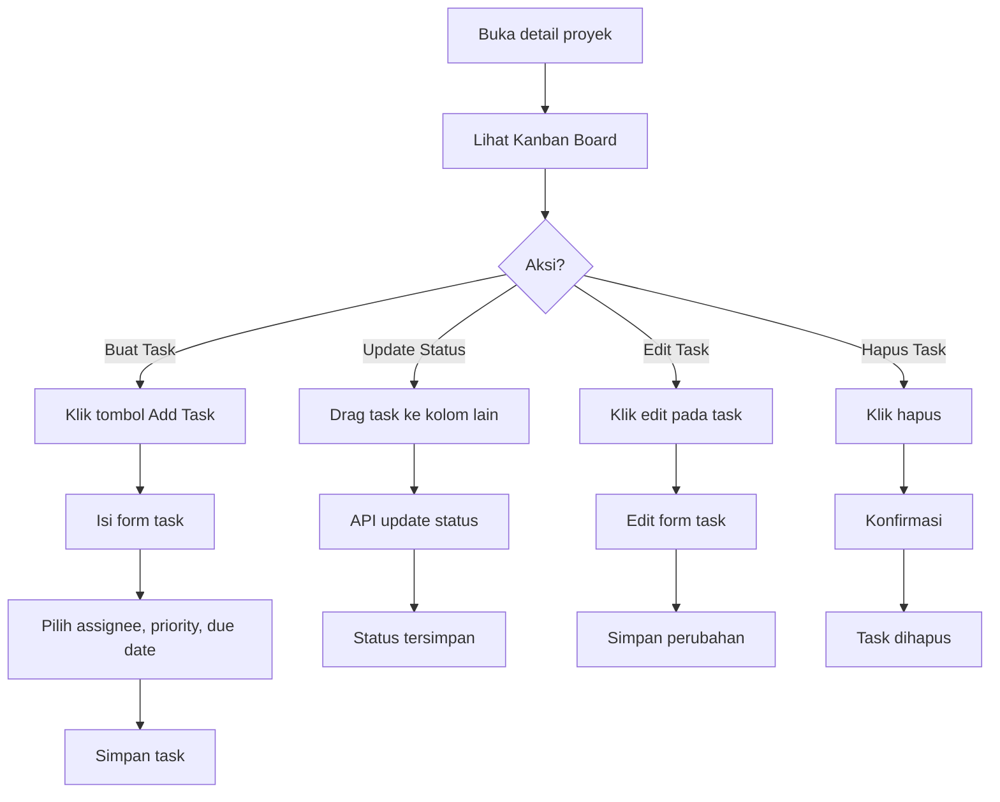

# 🚀 Sistem Manajemen Proyek (Project Management System)

Aplikasi web untuk mengelola proyek, tugas (tasks), dan tim dengan sistem role-based access control (RBAC) yang lengkap. Dibangun dengan Laravel 10 dan menggunakan tampilan modern yang responsif.

---

## 📋 Daftar Isi

- [Penjelasan Project](#-penjelasan-project)
- [Kegunaan Project](#-kegunaan-project)
- [Siapa yang Menggunakan](#-siapa-yang-menggunakan)
- [Contoh Penggunaan Nyata](#-contoh-penggunaan-nyata)
- [Fitur Utama](#-fitur-utama)
- [Teknologi yang Digunakan](#️-teknologi-yang-digunakan)
- [Persyaratan Sistem](#-persyaratan-sistem)
- [Instalasi](#-instalasi)
- [Struktur Database](#️-struktur-database)
- [Alur Sistem](#-alur-sistem)
- [Arsitektur Aplikasi](#-arsitektur-aplikasi)
- [Penggunaan](#-penggunaan)

---

## 📖 Penjelasan Project

### Apa itu Project ini?

Project ini adalah **Sistem Manajemen Proyek (Project Management System)** berbasis web yang dibangun menggunakan framework **Laravel 10**. Aplikasi ini dirancang untuk membantu tim atau perusahaan dalam mengelola proyek-proyek kerja secara efisien dan terorganisir.

### Ringkasan Singkat

> **Intinya:** Project ini adalah alat untuk membantu tim bekerja lebih terorganisir dengan fitur manajemen proyek, pembagian tugas, dan pelacakan progress dalam satu platform terintegrasi.

### Keunggulan Utama:
- ✅ **Role-Based Access Control** - Tiga level pengguna dengan hak akses berbeda
- ✅ **Kanban Board** - Visualisasi tugas dengan drag-and-drop
- ✅ **Dashboard Dinamis** - Tampilan berbeda sesuai role pengguna
- ✅ **Manajemen Tim** - Pengelolaan anggota proyek
- ✅ **Laporan & Statistik** - Monitoring progress proyek
- ✅ **Activity Logging** - Pelacakan aktivitas pengguna

---

## 🎯 Kegunaan Project

| Kegunaan | Deskripsi |
|----------|-----------|
| **Mengelola Proyek** | Membuat, mengedit, dan melacak proyek dengan informasi lengkap (nama, deskripsi, budget, deadline, status) |
| **Mengelola Tugas (Tasks)** | Membagi proyek menjadi tugas-tugas kecil yang dapat di-assign ke anggota tim |
| **Kolaborasi Tim** | Menambahkan anggota ke proyek dan assign tugas kepada mereka |
| **Visualisasi Progress** | Kanban board untuk melihat status tugas (Todo → In Progress → Review → Completed) |
| **Monitoring & Laporan** | Dashboard statistik dan laporan untuk memantau progress |
| **Audit Trail** | Activity log untuk melacak siapa melakukan apa dan kapan |

---

## 👥 Siapa yang Menggunakan?

Aplikasi ini memiliki **3 tipe pengguna** dengan hak akses berbeda:

### 1. ADMIN
- Akses penuh ke seluruh sistem
- Kelola semua user, proyek, dan tugas
- Lihat activity logs & reports
- Dapat membuat, edit, hapus semua data

### 2. MANAGER
- Buat dan kelola proyek sendiri
- Assign anggota tim ke proyek
- Kelola tugas dalam proyek sendiri
- Lihat reports
- Tidak bisa mengakses manajemen user

### 3. USER (Member)
- Lihat proyek yang di-assign
- Update status tugas yang ditugaskan
- Buat tugas dalam proyek yang di-assign
- Tidak bisa membuat proyek baru

---

## 💡 Contoh Penggunaan Nyata

### Skenario: Tim Software Development

1. **Admin** membuat akun untuk semua anggota tim (Developer, Designer, QA)

2. **Manager** membuat proyek baru: "Website E-Commerce"
   - Set deadline: 3 bulan
   - Set budget: Rp 50.000.000
   - Tambah anggota: Alice (Developer), Bob (Designer), Charlie (QA)

3. **Manager** membuat tugas-tugas:
   - "Desain UI Mockup" → assign ke Bob
   - "Setup Database" → assign ke Alice
   - "Testing Plan" → assign ke Charlie

4. **Anggota tim** mengerjakan tugas dan update status:
   - `Todo` → `In Progress` → `Review` → `Completed`

5. **Manager/Admin** memantau progress di dashboard dan melihat laporan

### Skenario: Agensi Kreatif

1. **Manager** membuat proyek "Rebranding Client ABC"
2. Assign tim: Designer, Copywriter, Social Media Manager
3. Buat tasks: Logo Design, Brand Guidelines, Social Media Kit
4. Tim update progress via Kanban board
5. Client dapat melihat progress (jika diberi akses)

---

## ✨ Fitur Utama

### 1. **Autentikasi & Otorisasi**
   - Login dan Register
   - Sistem role: `admin`, `manager`, `user`
   - Middleware untuk proteksi route

### 2. **Manajemen Proyek**
   - CRUD proyek (Create, Read, Update, Delete)
   - Status proyek: `planning`, `active`, `completed`, `on-hold`
   - Pengelolaan budget dan deadline
   - Assign anggota tim ke proyek

### 3. **Manajemen Tugas (Tasks)**
   - CRUD tugas dalam proyek
   - Status: `todo`, `in-progress`, `review`, `completed`
   - Prioritas: `low`, `medium`, `high`, `urgent`
   - Assign tugas ke anggota tim
   - Due date tracking
   - Kanban board interface dengan drag & drop

### 4. **Manajemen Pengguna (Admin Only)**
   - CRUD pengguna
   - Pengaturan role pengguna
   - Upload foto profil

### 5. **Dashboard**
   - Statistik real-time
   - Proyek terbaru
   - Tugas mendatang
   - Tugas yang overdue
   - Tampilan berbeda sesuai role

### 6. **Laporan (Reports)**
   - Statistik keseluruhan
   - Laporan per proyek
   - Laporan performa pengguna

### 7. **Activity Log (Admin Only)**
   - Riwayat aktivitas sistem
   - Tracking perubahan data (create, update, delete)

### 8. **Fitur Teknis Lainnya**
   - Filter & Search proyek
   - Progress tracking otomatis
   - Overdue detection
   - Responsive design

---

## 🛠️ Teknologi yang Digunakan

| Kategori | Teknologi |
|----------|-----------|
| **Backend** | Laravel 10, PHP 8.2 |
| **Frontend** | Blade Templates, TailwindCSS, Alpine.js |
| **Database** | MySQL / MariaDB |
| **Build Tools** | Vite, NPM |
| **Authentication** | Laravel Breeze |
| **API** | Laravel Sanctum |

---

## 💻 Persyaratan Sistem

- PHP >= 8.1
- Composer
- Node.js >= 16.x
- NPM atau Yarn
- MySQL / MariaDB
- XAMPP / Laragon / Herd (untuk development lokal)

---

## 🔧 Instalasi

### 1. Clone Repository
```bash
git clone <repository-url>
cd laravel
```

### 2. Install Dependencies
```bash
composer install
npm install
```

### 3. Konfigurasi Environment
```bash
cp .env.example .env
php artisan key:generate
```

### 4. Konfigurasi Database
Edit file `.env`:
```env
DB_CONNECTION=mysql
DB_HOST=127.0.0.1
DB_PORT=3306
DB_DATABASE=sistem-gudang
DB_USERNAME=root
DB_PASSWORD=
```

### 5. Migrasi Database
```bash
php artisan migrate
# atau gunakan file database.sql untuk import langsung
```

### 6. Jalankan Aplikasi
```bash
# Terminal 1: Backend
php artisan serve

# Terminal 2: Frontend (Vite)
npm run dev
```

Akses aplikasi di: `http://127.0.0.1:8000`

---

## 🗄️ Struktur Database

### Entity Relationship Diagram (ERD)



### Deskripsi Tabel

#### 1. **users** - Tabel Pengguna
| Kolom | Tipe | Deskripsi |
|-------|------|-----------|
| `id` | bigint | Primary key |
| `name` | varchar(255) | Nama lengkap pengguna |
| `email` | varchar(255) | Email (unique) |
| `profile_photo` | varchar(255) | Path foto profil |
| `role` | enum | Role: `admin`, `manager`, `user` |
| `password` | varchar(255) | Password terenkripsi |
| `email_verified_at` | timestamp | Waktu verifikasi email |
| `created_at` / `updated_at` | timestamp | Timestamps |

#### 2. **projects** - Tabel Proyek
| Kolom | Tipe | Deskripsi |
|-------|------|-----------|
| `id` | bigint | Primary key |
| `name` | varchar(255) | Nama proyek |
| `description` | text | Deskripsi proyek |
| `status` | enum | `planning`, `active`, `completed`, `on-hold` |
| `start_date` | date | Tanggal mulai |
| `end_date` | date | Tanggal selesai |
| `budget` | decimal(12,2) | Anggaran proyek |
| `user_id` | bigint | FK ke owner (users) |

#### 3. **tasks** - Tabel Tugas
| Kolom | Tipe | Deskripsi |
|-------|------|-----------|
| `id` | bigint | Primary key |
| `project_id` | bigint | FK ke projects |
| `title` | varchar(255) | Judul tugas |
| `description` | text | Deskripsi tugas |
| `status` | enum | `todo`, `in-progress`, `review`, `completed` |
| `priority` | enum | `low`, `medium`, `high`, `urgent` |
| `assigned_to` | bigint | FK ke users (yang ditugaskan) |
| `due_date` | date | Tenggat waktu |

#### 4. **project_members** - Tabel Pivot Anggota Proyek
| Kolom | Tipe | Deskripsi |
|-------|------|-----------|
| `id` | bigint | Primary key |
| `project_id` | bigint | FK ke projects |
| `user_id` | bigint | FK ke users |
| `role` | enum | `manager`, `member` |

#### 5. **activity_logs** - Tabel Log Aktivitas
| Kolom | Tipe | Deskripsi |
|-------|------|-----------|
| `id` | bigint | Primary key |
| `user_id` | bigint | FK ke users (pelaku) |
| `action` | varchar(255) | Jenis aksi (create, update, delete) |
| `model_type` | varchar(255) | Tipe model yang diubah |
| `model_id` | bigint | ID model yang diubah |
| `description` | text | Deskripsi aktivitas |
| `ip_address` | varchar(45) | Alamat IP pelaku |
| `user_agent` | text | Browser/device info |

---

## 🔄 Alur Sistem

### 1. Alur Autentikasi



### 2. Alur Manajemen Proyek



### 3. Alur Manajemen Tugas (Tasks)



### 4. Alur Role-Based Access Control

```
┌─────────────────────────────────────────────────────────────────────────┐
│                              ADMIN                                       │
│  ✓ Semua akses                                                          │
│  ✓ Manajemen User (CRUD)                                                │
│  ✓ Activity Logs (View)                                                 │
│  ✓ Reports (View)                                                       │
│  ✓ Semua Proyek & Tasks (CRUD)                                          │
├─────────────────────────────────────────────────────────────────────────┤
│                             MANAGER                                      │
│  ✓ CRUD Proyek sendiri                                                  │
│  ✓ CRUD Tasks pada proyek sendiri                                       │
│  ✓ Lihat Reports                                                        │
│  ✓ Assign anggota tim                                                   │
│  ✗ Manajemen User                                                       │
│  ✗ Activity Logs                                                        │
├─────────────────────────────────────────────────────────────────────────┤
│                               USER                                       │
│  ✓ Lihat proyek yang di-assign                                          │
│  ✓ Update status task sendiri                                           │
│  ✓ Buat task di proyek yang di-assign                                   │
│  ✗ CRUD Proyek                                                          │
│  ✗ Manajemen User                                                       │
│  ✗ Reports                                                              │
└─────────────────────────────────────────────────────────────────────────┘
```

---

## 🏗️ Arsitektur Aplikasi

### Struktur Direktori

```
laravel/
├── app/
│   ├── Http/
│   │   ├── Controllers/
│   │   │   ├── ActivityLogController.php    # Log aktivitas
│   │   │   ├── DashboardController.php      # Dashboard dinamis per role
│   │   │   ├── ProfileController.php        # Profil pengguna
│   │   │   ├── ProjectController.php        # CRUD proyek
│   │   │   ├── ReportController.php         # Laporan & statistik
│   │   │   ├── TaskController.php           # CRUD tugas
│   │   │   └── UserController.php           # Manajemen user (admin)
│   │   └── Middleware/
│   │       └── RoleMiddleware.php           # Middleware cek role
│   ├── Models/
│   │   ├── ActivityLog.php                  # Model log aktivitas
│   │   ├── Project.php                      # Model proyek
│   │   ├── Task.php                         # Model tugas
│   │   └── User.php                         # Model pengguna
│   └── Policies/
│       └── ProjectPolicy.php                # Authorization policies
├── database/
│   ├── migrations/                          # File migrasi database
│   └── seeders/                             # Seeder data dummy
├── resources/
│   ├── views/
│   │   ├── activity-logs/                   # View log aktivitas
│   │   ├── auth/                            # View autentikasi
│   │   ├── components/                      # Blade components
│   │   ├── dashboard.blade.php              # Halaman dashboard
│   │   ├── layouts/                         # Layout aplikasi
│   │   ├── profile/                         # View profil
│   │   ├── projects/                        # View proyek
│   │   ├── reports/                         # View laporan
│   │   └── users/                           # View manajemen user
│   └── css/
│       └── app.css                          # Stylesheet utama
├── routes/
│   ├── web.php                              # Route web utama
│   └── auth.php                             # Route autentikasi
└── database.sql                             # SQL dump database
```

### Penjelasan Controller

| Controller | Fungsi |
|------------|--------|
| `DashboardController` | Menampilkan dashboard berbeda untuk setiap role (Admin, Manager, User) |
| `ProjectController` | CRUD proyek dengan filter berdasarkan role pengguna |
| `TaskController` | CRUD tugas, update status (kanban), assign user |
| `UserController` | Manajemen user (Admin only) - CRUD pengguna |
| `ReportController` | Generate laporan dan statistik proyek/user |
| `ActivityLogController` | Menampilkan riwayat aktivitas sistem |
| `ProfileController` | Mengelola profil pengguna sendiri |

### Penjelasan Model & Relasi

| Model | Relasi |
|-------|--------|
| `User` | hasMany(Project), hasMany(Task), belongsToMany(Project via project_members), hasMany(ActivityLog) |
| `Project` | belongsTo(User as owner), hasMany(Task), belongsToMany(User as members) |
| `Task` | belongsTo(Project), belongsTo(User as assignedUser) |
| `ActivityLog` | belongsTo(User) |

---

## 📱 Penggunaan

### Akun Demo

| Role | Email | Password |
|------|-------|----------|
| Admin | yhgeming1@gmail.com | password |
| Manager | manager1@example.com | password |
| User | member1@example.com | password |

### Navigasi Utama

1. **Dashboard** - Halaman utama dengan statistik
2. **Projects** - Daftar dan kelola proyek
3. **Users** - Manajemen pengguna (Admin only)
4. **Reports** - Laporan dan statistik (Admin & Manager)
5. **Activity Logs** - Riwayat aktivitas (Admin only)

### Tips Penggunaan

#### Membuat Proyek Baru:
1. Login sebagai Admin/Manager
2. Klik "Projects" → "Create Project"
3. Isi detail proyek dan pilih anggota tim
4. Klik "Create Project"

#### Mengelola Tugas dengan Kanban:
1. Buka detail proyek
2. Gunakan drag-and-drop untuk memindahkan tugas antar kolom
3. Klik tugas untuk melihat/edit detail

#### Melihat Statistik:
1. Dashboard menampilkan ringkasan
2. Reports menampilkan detail lengkap

---

## 📄 Lisensi

Proyek ini dibuat untuk keperluan pembelajaran dan pengembangan.

---

## 👨‍💻 Pengembang

ALDY
