# Dokumentasi Lengkap - Sistem Manajemen Proyek Laravel

## 📋 Daftar Isi

1. [Ringkasan Project](#ringkasan-project)
2. [Teknologi yang Digunakan](#teknologi-yang-digunakan)
3. [Struktur Database](#struktur-database)
4. [Arsitektur Sistem](#arsitektur-sistem)
5. [Role dan Permissions](#role-dan-permissions)
6. [Alur Sistem](#alur-sistem)
7. [Fitur-Fitur Utama](#fitur-fitur-utama)
8. [Model dan Relasi](#model-dan-relasi)
9. [Controller dan Logic](#controller-dan-logic)
10. [Routes dan Middleware](#routes-dan-middleware)

---

## Ringkasan Project

**Sistem Manajemen Proyek Laravel** adalah aplikasi web berbasis Laravel 10 yang dirancang untuk mengelola proyek dan tugas (tasks) dengan sistem role-based access control (RBAC). Sistem ini memungkinkan tim untuk berkolaborasi dalam mengelola proyek dengan efisien.

### Tujuan Sistem
- Mengelola proyek dari tahap perencanaan hingga selesai
- Mengatur tugas-tugas dalam setiap proyek
- Memberikan akses berbeda berdasarkan role pengguna
- Tracking progress proyek dan tugas
- Kolaborasi tim yang terorganisir

### Karakteristik Utama
- **Multi-role System**: Admin, Manager, dan Member
- **Project Management**: CRUD proyek dengan status tracking
- **Task Management**: Kanban-style task board
- **Team Collaboration**: System keanggotaan proyek
- **Authorization**: Policy-based access control

---

## Teknologi yang Digunakan

### Backend
- **Framework**: Laravel 10
- **PHP Version**: 8.1+
- **Database**: SQLite (dapat diganti dengan MySQL/PostgreSQL)
- **Authentication**: Laravel Breeze

### Frontend
- **CSS Framework**: Tailwind CSS
- **JavaScript**: Vanilla JS dengan Alpine.js (optional)
- **Build Tool**: Vite
- **UI Style**: Modern dengan glassmorphism effects

### Package & Dependencies
- `laravel/sanctum` - API authentication
- `laravel/breeze` - Authentication scaffolding
- `tailwindcss` - Utility-first CSS framework

---

## Struktur Database

### 📊 Entity Relationship Diagram


### 1️⃣ Tabel: `users`

Menyimpan informasi pengguna sistem.

| Kolom | Tipe | Keterangan |
|-------|------|------------|
| `id` | BIGINT (PK) | Primary key, auto increment |
| `name` | VARCHAR(255) | Nama lengkap pengguna |
| `email` | VARCHAR(255) UNIQUE | Email untuk login, harus unique |
| `password` | VARCHAR(255) | Password ter-hash (bcrypt) |
| `role` | ENUM('admin', 'manager', 'member') | Role pengguna, default: 'member' |
| `profile_photo` | VARCHAR(255) NULL | Path foto profil |
| `email_verified_at` | TIMESTAMP NULL | Waktu verifikasi email |
| `remember_token` | VARCHAR(100) NULL | Token untuk "Remember Me" |
| `created_at` | TIMESTAMP | Waktu pembuatan record |
| `updated_at` | TIMESTAMP | Waktu update terakhir |

**Penjelasan Role:**
- **Admin**: Akses penuh ke seluruh sistem
- **Manager**: Dapat membuat dan mengelola proyek
- **Member**: Dapat melihat proyek yang ditugaskan dan mengerjakan tasks

---

### 2️⃣ Tabel: `projects`

Menyimpan informasi proyek.

| Kolom | Tipe | Keterangan |
|-------|------|------------|
| `id` | BIGINT (PK) | Primary key, auto increment |
| `name` | VARCHAR(255) | Nama proyek |
| `description` | TEXT NULL | Deskripsi detail proyek |
| `status` | ENUM('planning', 'active', 'completed', 'on-hold') | Status proyek, default: 'planning' |
| `start_date` | DATE NULL | Tanggal mulai proyek |
| `end_date` | DATE NULL | Tanggal target selesai |
| `budget` | DECIMAL(12,2) NULL | Anggaran proyek |
| `user_id` | BIGINT (FK) | ID pemilik/creator proyek |
| `created_at` | TIMESTAMP | Waktu pembuatan proyek |
| `updated_at` | TIMESTAMP | Waktu update terakhir |

**Foreign Key:**
- `user_id` → `users.id` (ON DELETE CASCADE)

**Status Proyek:**
- **planning**: Tahap perencanaan
- **active**: Sedang dikerjakan
- **completed**: Sudah selesai
- **on-hold**: Ditunda sementara

---

### 3️⃣ Tabel: `tasks`

Menyimpan tugas-tugas dalam proyek.

| Kolom | Tipe | Keterangan |
|-------|------|------------|
| `id` | BIGINT (PK) | Primary key, auto increment |
| `project_id` | BIGINT (FK) | ID proyek induk |
| `title` | VARCHAR(255) | Judul tugas |
| `description` | TEXT NULL | Detail tugas |
| `status` | ENUM('todo', 'in-progress', 'review', 'completed') | Status tugas, default: 'todo' |
| `priority` | ENUM('low', 'medium', 'high', 'urgent') | Prioritas tugas, default: 'medium' |
| `assigned_to` | BIGINT (FK) NULL | ID user yang ditugaskan |
| `due_date` | DATE NULL | Deadline tugas |
| `created_at` | TIMESTAMP | Waktu pembuatan tugas |
| `updated_at` | TIMESTAMP | Waktu update terakhir |

**Foreign Keys:**
- `project_id` → `projects.id` (ON DELETE CASCADE)
- `assigned_to` → `users.id` (ON DELETE SET NULL)

**Status Tugas (Kanban Flow):**
1. **todo**: Belum dikerjakan
2. **in-progress**: Sedang dikerjakan
3. **review**: Perlu review
4. **completed**: Sudah selesai

**Priority Levels:**
- **urgent**: Sangat mendesak (merah)
- **high**: Prioritas tinggi (orange)
- **medium**: Prioritas sedang (kuning)
- **low**: Prioritas rendah (hijau)

---

### 4️⃣ Tabel: `project_members`

Tabel pivot untuk relasi many-to-many antara users dan projects.

| Kolom | Tipe | Keterangan |
|-------|------|------------|
| `id` | BIGINT (PK) | Primary key, auto increment |
| `project_id` | BIGINT (FK) | ID proyek |
| `user_id` | BIGINT (FK) | ID user/member |
| `role` | ENUM('manager', 'member') | Role dalam proyek, default: 'member' |
| `created_at` | TIMESTAMP | Waktu ditambahkan ke proyek |
| `updated_at` | TIMESTAMP | Waktu update terakhir |

**Foreign Keys:**
- `project_id` → `projects.id` (ON DELETE CASCADE)
- `user_id` → `users.id` (ON DELETE CASCADE)

**Unique Constraint:**
- (`project_id`, `user_id`) → Satu user tidak bisa ditambahkan 2 kali di proyek yang sama

**Project Role:**
- **manager**: Manager dalam proyek tertentu
- **member**: Member biasa dalam proyek

---

### 5️⃣ Tabel Standar Laravel

**`password_reset_tokens`**: Token untuk reset password
**`failed_jobs`**: Log job yang gagal
**`personal_access_tokens`**: Token API (Laravel Sanctum)

---

## Arsitektur Sistem

### 🏗️ Arsitektur MVC (Model-View-Controller)


### Komponen Utama

#### 1. **Routes** (`routes/web.php`)
- Mendefinisikan endpoint aplikasi
- Menerapkan middleware untuk proteksi
- Menghubungkan URL ke Controller method

#### 2. **Middleware**
- **`auth`**: Memastikan user sudah login
- **`role`**: Memeriksa role user (admin, manager, member)

#### 3. **Controllers** (`app/Http/Controllers/`)
- **DashboardController**: Menampilkan dashboard sesuai role
- **ProjectController**: CRUD dan logic proyek
- **TaskController**: CRUD dan logic tugas
- **ProfileController**: Manajemen profil user

#### 4. **Models** (`app/Models/`)
- **User**: Model pengguna
- **Project**: Model proyek
- **Task**: Model tugas
- Mendefinisikan relationships Eloquent

#### 5. **Policies** (`app/Policies/`)
- **ProjectPolicy**: Authorization logic untuk proyek
- Menentukan siapa bisa view, create, update, delete

#### 6. **Views** (`resources/views/`)
- Blade templates untuk UI
- Komponen reusable
- Layout utama

---

## Role dan Permissions

### 🔐 Hierarki Role

```mermaid
graph TD
    Admin[👑 Admin] -->|Full Access| AllProjects[Semua Proyek & Tugas]
    Admin -->|Manage| AllUsers[Semua User]
    
    Manager[👔 Manager] -->|Own| OwnProjects[Proyek yang Dibuat]
    Manager -->|Member of| AssignedProjects[Proyek yang Ditugaskan]
    Manager -->|Create| NewProjects[Proyek Baru]
    
    Member[👤 Member] -->|View| MemberProjects[Proyek yang Ditugaskan]
    Member -->|Update| OwnTasks[Tugas Sendiri]
    Member -->|Create| ProjectTasks[Task di Proyek Member]
    
    style Admin fill:#ff6b6b
    style Manager fill:#4dabf7
    style Member fill:#51cf66
```



### Matriks Permission

| Aksi | Admin | Manager | Member |
|------|-------|---------|--------|
| **PROJECTS** | | | |
| View All Projects | ✅ | ✅ Own + Assigned | ✅ Assigned Only |
| Create Project | ✅ | ✅ | ❌ |
| Edit Project | ✅ | ✅ Own Only | ❌ |
| Delete Project | ✅ | ✅ Own Only | ❌ |
| View Project Detail | ✅ | ✅ If Owner/Member | ✅ If Member |
| Manage Project Members | ✅ | ✅ Own Only | ❌ |
| **TASKS** | | | |
| View Tasks | ✅ | ✅ Project Tasks | ✅ Assigned Only |
| Create Task | ✅ | ✅ | ✅ In Member Projects |
| Edit Task (Full) | ✅ | ✅ | ❌ |
| Edit Task Status | ✅ | ✅ | ✅ Own Tasks |
| Delete Task | ✅ | ✅ | ❌ |
| Assign Task | ✅ | ✅ | ❌ |
| **USERS** | | | |
| View Users | ✅ | ✅ Limited | ✅ Limited |
| Manage Users | ✅ | ❌ | ❌ |

---

## Alur Sistem

### 🔄 Alur Autentikasi


**Penjelasan:**
1. User mengakses aplikasi → redirect ke login jika belum auth
2. User submit form login
3. System validasi kredensial di database
4. Jika valid, buat session dan redirect ke dashboard
5. Dashboard menyesuaikan tampilan berdasarkan role user

---

### 🔄 Alur Manajemen Proyek


**Langkah-langkah:**
1. **Create Project** (Manager/Admin only):
   - Akses form create
   - Policy check authorization
   - Validasi input data
   - Simpan ke database dengan user_id = creator
   - Attach members jika ada
   - Redirect ke detail proyek

2. **Edit Project**:
   - Hanya owner atau admin
   - Load data proyek saat ini
   - Update data
   - Sync members (add/remove)

3. **Delete Project**:
   - Hanya owner atau admin
   - Cascade delete tasks dan members

---

### 🔄 Alur Manajemen Task


**Proses Task Management:**

1. **Create Task**:
   - Cek apakah user adalah admin, manager, atau member dari proyek
   - Validasi input (title, description, status, priority, due_date)
   - Simpan dengan project_id
   - Bisa assign ke member tertentu

2. **Update Task**:
   - **Admin/Manager**: Bisa edit semua field
   - **Member**: Hanya bisa update status task yang di-assign ke dia
   - Validasi sesuai permission

3. **Update Task Status** (Drag & Drop Kanban):
   - User drag task ke kolom lain
   - AJAX request ke endpoint `/tasks/{id}/status`
   - Update only status field
   - Member hanya bisa update task sendiri

4. **Delete Task**:
   - Hanya admin dan manager proyek
   - Permanent delete dari database

---

### 🔄 Alur Dashboard Role-Based


---

## Fitur-Fitur Utama

### 1. 🔐 Authentication & Authorization

**Files terkait:**
- [web.php](file:///b:/sistem-project10/laravel/routes/web.php)
- [RoleMiddleware.php](file:///b:/sistem-project10/laravel/app/Http/Middleware/RoleMiddleware.php)
- [ProjectPolicy.php](file:///b:/sistem-project10/laravel/app/Policies/ProjectPolicy.php)

**Fitur:**
- Login/Register dengan Laravel Breeze
- Session-based authentication
- Role-based access control (RBAC)
- Policy-based authorization
- Middleware protection untuk routes

**Flow:**
1. User register → role default: 'member'
2. Login → create session
3. Setiap request → check middleware `auth`
4. Action tertentu → check middleware `role`
5. CRUD operations → check via Policy

---

### 2. 📊 Dashboard Role-Based

**File:** [DashboardController.php](file:///b:/sistem-project10/laravel/app/Http/Controllers/DashboardController.php)

**Admin Dashboard:**
- Total projects, active projects, tasks, users
- Recent projects (6 terbaru)
- Upcoming tasks (5 terdekat deadline)
- Overdue tasks count
- System-wide statistics

**Manager Dashboard:**
- My projects count
- Active projects count
- Total tasks in owned projects
- Completed tasks
- Recent own projects
- Upcoming tasks in own projects
- Overdue tasks in own projects

**Member Dashboard:**
- My tasks count
- Completed tasks
- Pending tasks (todo + in-progress)
- Assigned projects count
- List of pending tasks (10 teratas)
- Recent assigned projects
- My overdue tasks

---

### 3. 📁 Project Management

**File:** [ProjectController.php](file:///b:/sistem-project10/laravel/app/Http/Controllers/ProjectController.php)

**Fitur:**

#### Index/List Projects
- Filter berdasarkan role:
  - Admin: Lihat semua proyek
  - Manager: Proyek sendiri + proyek yang jadi member
  - Member: Hanya proyek yang ditugaskan
- Search by name
- Filter by status
- Pagination (12 per page)

#### Create Project
- Form input: name, description, status, dates, budget
- Select members to add
- Only Manager/Admin

#### View Project Detail
- Info proyek lengkap
- Kanban board untuk tasks (4 kolom: todo, in-progress, review, completed)
- List members
- Progress percentage
- Quick actions (edit, delete)

#### Edit Project
- Update all project fields
- Sync members (add/remove)
- Only owner/admin

#### Delete Project
- Cascade delete tasks dan members
- Only owner/admin

**Calculated Attributes:**
- `progress`: Persentase completion (tasks completed / total tasks)
- `isOverdue()`: Cek apakah melewati deadline
- `daysRemaining()`: Hitung sisa hari

---

### 4. ✅ Task Management

**File:** [TaskController.php](file:///b:/sistem-project10/laravel/app/Http/Controllers/TaskController.php)

#### Create Task
- Input: title, description, status, priority, assigned_to, due_date
- Authorization:
  - Admin/Manager: Always allowed
  - Member: Only if member of the project
- Bisa via modal (AJAX) atau form biasa

#### Update Task
- **Full Update** (Admin/Manager):
  - Edit semua field
  - Reassign task
  
- **Status Update Only** (Member):
  - Hanya bisa update status
  - Hanya untuk task yang di-assign ke mereka

#### Delete Task
- Only Admin/Manager
- Hard delete

#### Update Status (Kanban Drag-Drop)
- Endpoint khusus: `POST /tasks/{task}/status`
- AJAX request
- Update only status field
- Member cek: hanya task sendiri

**Helper Methods:**
- `isOverdue()`: Cek task lewat deadline
- `daysRemaining()`: Sisa hari sampai deadline
- Priority color mapping
- Status color mapping

---

### 5. 👥 Team Collaboration

**Fitur Member Management:**
- Add members saat create/edit project
- Members bisa create tasks di project
- Members bisa update status task sendiri
- Pivot table `project_members` dengan role

**Permissions:**
- Project members bisa view project detail
- Project members bisa create tasks
- Tidak semua member bisa edit/delete

---

### 6. 🎨 Modern UI/UX

**Design Features:**
- Glassmorphism effects
- Dark mode support
- Responsive design (mobile-friendly)
- Smooth animations
- Color-coded priorities dan status
- Kanban board visual
- Modal dialogs untuk quick actions

---

## Model dan Relasi

### 📦 User Model

**File:** [User.php](file:///b:/sistem-project10/laravel/app/Models/User.php)

```php
// Relationships
projects()         // hasMany - Proyek yang dimiliki
assignedProjects() // belongsToMany - Proyek sebagai member
tasks()           // hasMany - Tasks yang di-assign

// Helper Methods
isAdmin()           // Check role admin
isManager()         // Check role manager
isMember()          // Check role member
canManageProjects() // Check admin atau manager
```

**Relasi:**
- **1 User → Many Projects** (as owner)
- **Many Users ↔ Many Projects** (as members)
- **1 User → Many Tasks** (as assigned user)

---

### 📦 Project Model

**File:** [Project.php](file:///b:/sistem-project10/laravel/app/Models/Project.php)

```php
// Relationships
owner()   // belongsTo User - Pemilik proyek
tasks()   // hasMany Task - Semua tasks
members() // belongsToMany User - Members proyek

// Accessors
getProgressAttribute() // Hitung progress %

// Methods
tasksByStatus($status)    // Get tasks by status
isOverdue()               // Check apakah overdue
daysRemaining()           // Hitung sisa hari
userCanCreateTask($user)  // Check permission create task
```

**Relasi:**
- **1 Project → 1 User** (owner)
- **1 Project → Many Tasks**
- **Many Projects ↔ Many Users** (members via pivot)

**Casts:**
- `start_date`, `end_date` → Carbon Date
- `budget` → Decimal(2)

---

### 📦 Task Model

**File:** [Task.php](file:///b:/sistem-project10/laravel/app/Models/Task.php)

```php
// Relationships
project()      // belongsTo Project
assignedUser() // belongsTo User

// Scopes
scopeStatus($status)    // Filter by status
scopePriority($priority) // Filter by priority
scopeOverdue()          // Get overdue tasks

// Methods
isOverdue()             // Check overdue
daysRemaining()         // Sisa hari

// Accessors
getPriorityColorAttribute() // Color untuk UI
getStatusColorAttribute()   // Color untuk UI
```

**Relasi:**
- **1 Task → 1 Project**
- **1 Task → 1 User** (assigned, nullable)

**Casts:**
- `due_date` → Carbon Date

**Priority Colors:**
- urgent → red
- high → orange
- medium → yellow
- low → green

**Status Colors:**
- completed → green
- review → blue
- in-progress → purple
- todo → gray

---

### 🔗 Relasi Lengkap


---

## Controller dan Logic

### 🎮 DashboardController

**File:** [DashboardController.php](file:///b:/sistem-project10/laravel/app/Http/Controllers/DashboardController.php)

**Methods:**
- `index()`: Entry point, route ke dashboard sesuai role
- `adminDashboard()`: Logic untuk admin
- `managerDashboard()`: Logic untuk manager
- `memberDashboard()`: Logic untuk member

**Query Optimization:**
- Eager loading: `with('owner', 'tasks')`
- Counting: Gunakan `count()` tanpa load data
- Filtering: `whereHas()` untuk relasi

---

### 🎮 ProjectController

**File:** [ProjectController.php](file:///b:/sistem-project10/laravel/app/Http/Controllers/ProjectController.php)

**Methods:**

| Method | Route | Permission | Fungsi |
|--------|-------|------------|--------|
| `index()` | GET /projects | All | List projects dengan filter role |
| `create()` | GET /projects/create | Manager/Admin | Form create |
| `store()` | POST /projects | Manager/Admin | Save new project |
| `show()` | GET /projects/{id} | Owner/Member/Admin | Detail proyek |
| `edit()` | GET /projects/{id}/edit | Owner/Admin | Form edit |
| `update()` | PATCH /projects/{id} | Owner/Admin | Update project |
| `destroy()` | DELETE /projects/{id} | Owner/Admin | Delete project |

**Authorization:**
- `$this->authorize('action', $project)` → Gunakan Policy
- Custom logic di `index()` untuk filter berdasarkan role

**Validasi:**
- name: required, string, max 255
- status: enum validation
- end_date: after_or_equal start_date
- members: array of user IDs

---

### 🎮 TaskController

**File:** [TaskController.php](file:///b:/sistem-project10/laravel/app/Http/Controllers/TaskController.php)

**Methods:**

| Method | Route | Permission | Fungsi |
|--------|-------|------------|--------|
| `store()` | POST /projects/{id}/tasks | Admin/Manager/Project Member | Create task |
| `update()` | PATCH /tasks/{id} | Admin/Manager/Task Owner | Update task |
| `destroy()` | DELETE /tasks/{id} | Admin/Manager | Delete task |
| `updateStatus()` | POST /tasks/{id}/status | All (own tasks) | Update status only |

**Custom Authorization:**
```php
// Di store(): Check if user is project member
$isMember = $project->members()->where('user_id', $user->id)->exists();
$isOwner = $project->user_id === $user->id;

if (!$isMember && !$isOwner && !$user->isAdmin() && !$user->isManager()) {
    abort(403);
}
```

**AJAX Support:**
- Check `$request->ajax()`
- Return JSON response untuk modal/kanban

---

## Routes dan Middleware

### 🛣️ Web Routes

**File:** [web.php](file:///b:/sistem-project10/laravel/routes/web.php)

**Route Structure:**

```
/ → redirect to /login

Middleware: auth
├── /dashboard
├── /profile (edit, update, destroy)
│
├── /projects
│   ├── GET  /projects (index - all users)
│   ├── GET  /projects/{id} (show - owner/member/admin)
│   │
│   └── Middleware: role:admin,manager
│       ├── GET    /projects/create
│       ├── POST   /projects
│       ├── GET    /projects/{id}/edit
│       ├── PATCH  /projects/{id}
│       └── DELETE /projects/{id}
│
└── /tasks
    ├── POST   /projects/{id}/tasks (store - project members)
    ├── POST   /tasks/{id}/status (updateStatus - all)
    │
    └── Middleware: role:admin,manager
        ├── PATCH  /tasks/{id} (update)
        └── DELETE /tasks/{id} (destroy)
```

**Middleware Groups:**

1. **`auth`** - Semua routes dalam `/dashboard` dan sub-routes
2. **`role:admin,manager`** - Routes yang butuh manager/admin
3. **No middleware** - Public routes (login, register)

**Route Ordering:**
> ⚠️ **PENTING**: Specific routes HARUS sebelum wildcard routes!

```php
// ✅ CORRECT
Route::get('/projects/create', ...);  // Specific
Route::get('/projects/{project}', ...); // Wildcard

// ❌ WRONG
Route::get('/projects/{project}', ...); // Wildcard first
Route::get('/projects/create', ...);   // Never reached!
```

---

## Alur Lengkap Use Case

### Use Case 1: Manager Membuat Proyek Baru

**Steps:**
1. Manager login ke sistem
2. Klik "Projects" di navigation
3. Klik tombol "Create New Project"
4. Middleware `role:admin,manager` → ✅ Pass
5. Policy `create` → Check `canManageProjects()` → ✅ Pass
6. Form ditampilkan dengan:
   - Input: name, description, status, dates, budget
   - Select: members (list of users)
7. Manager mengisi form dan submit
8. `ProjectController@store`:
   - Validasi input
   - Set `user_id` = current user
   - Insert ke table `projects`
   - Loop members dan insert ke `project_members`
9. Redirect ke detail proyek
10. Proyek ditampilkan dengan kanban board kosong

---

### Use Case 2: Member Membuat Task di Proyek

**Steps:**
1. Member login
2. Buka "Projects" → Hanya muncul proyek yang dia jadi member
3. Klik salah satu proyek
4. Policy `view` → Check `isMember` → ✅ Pass
5. Lihat kanban board
6. Klik "Add Task" di kolom "To Do"
7. Modal form muncul
8. Isi task: title, description, priority, due_date
9. Submit via AJAX
10. `TaskController@store`:
    - Check: Is user member of this project? → ✅ Yes
    - Validasi input
    - Insert task dengan `project_id`
11. Return JSON dengan task data
12. Frontend update kanban board (prepend task baru)
13. Task muncul di kolom "To Do"

---

### Use Case 3: Member Update Status Task (Drag-Drop)

**Steps:**
1. Member buka detail proyek
2. Lihat task yang di-assign ke dia di kolom "To Do"
3. Drag task ke kolom "In Progress"
4. Event `ondrop` trigger AJAX
5. Request: `POST /tasks/{id}/status` dengan `{status: 'in-progress'}`
6. `TaskController@updateStatus`:
   - Check: Is task assigned to current user? → ✅ Yes
   - Validasi status
   - Update only `status` field
7. Return JSON success
8. Frontend: Task tetap di kolom baru
9. Database updated

---

### Use Case 4: Admin Melihat Semua Proyek

**Steps:**
1. Admin login
2. Navigate ke Dashboard
3. `DashboardController@index` → Deteksi role → `adminDashboard()`
4. Query:
   - Total projects (all)
   - Active projects (status = active)
   - Total tasks (all)
   - System-wide stats
5. Tampilkan dashboard dengan:
   - Statistics cards
   - Recent projects (6 terakhir)
   - Upcoming tasks across all projects
6. Admin klik "View All Projects"
7. `ProjectController@index`:
   - No filter (admin sees all)
   - Show all projects dengan pagination
8. Admin bisa klik any project → view detail
9. Admin bisa edit/delete any project

---

## Database Flow & Cascade

### Cascade Behaviors

**When Project Deleted:**
```
DELETE Project ID=1
  ↓
CASCADE DELETE tasks WHERE project_id=1
CASCADE DELETE project_members WHERE project_id=1
```

**When User Deleted:**
```
DELETE User ID=5
  ↓
CASCADE DELETE projects WHERE user_id=5
  ↓ (then cascade from projects)
  CASCADE DELETE tasks
  CASCADE DELETE project_members
  
SET NULL tasks.assigned_to WHERE assigned_to=5
CASCADE DELETE project_members WHERE user_id=5
```

**When Task Deleted:**
```
DELETE Task ID=10
  ↓
(No cascade, task adalah leaf node)
```

---

## Security & Best Practices

### 🔒 Security Measures

1. **Password Hashing**: Bcrypt via Laravel
2. **CSRF Protection**: Token di semua forms
3. **SQL Injection**: Eloquent ORM (prepared statements)
4. **XSS Protection**: Blade auto-escaping `{{ }}`
5. **Authorization**: Policy + Middleware
6. **Session Security**: HTTP-only cookies

### ✨ Best Practices

1. **Eager Loading**: Prevent N+1 queries
   ```php
   Project::with('owner', 'tasks', 'members')->get();
   ```

2. **Validation**: Semua input ter-validasi
3. **Mass Assignment Protection**: `$fillable` di models
4. **Soft Deletes**: Bisa diaktifkan untuk recovery
5. **Database Transactions**: Untuk operations yang kompleks
6. **API Resources**: Untuk format JSON yang konsisten

---

## Kesimpulan

Sistem Manajemen Proyek ini adalah aplikasi full-stack Laravel yang mengimplementasikan:

✅ **Role-Based Access Control** (RBAC) dengan 3 role  
✅ **RESTful Architecture** dengan MVC pattern  
✅ **Policy-Based Authorization** untuk fine-grained control  
✅ **Relational Database** dengan proper foreign keys & cascade  
✅ **Modern UI/UX** dengan Tailwind CSS dan glassmorphism  
✅ **Real-time Updates** via AJAX untuk kanban board  
✅ **Team Collaboration** dengan project members system  
✅ **Task Tracking** dengan Kanban-style workflow  

**Tech Stack:**
- Backend: Laravel 10 + SQLite
- Frontend: Blade + Tailwind CSS + Vite
- Auth: Laravel Breeze
- Architecture: MVC + Policy Pattern

---

## Referensi Files

### Controllers
- [DashboardController.php](file:///b:/sistem-project10/laravel/app/Http/Controllers/DashboardController.php)
- [ProjectController.php](file:///b:/sistem-project10/laravel/app/Http/Controllers/ProjectController.php)
- [TaskController.php](file:///b:/sistem-project10/laravel/app/Http/Controllers/TaskController.php)

### Models
- [User.php](file:///b:/sistem-project10/laravel/app/Models/User.php)
- [Project.php](file:///b:/sistem-project10/laravel/app/Models/Project.php)
- [Task.php](file:///b:/sistem-project10/laravel/app/Models/Task.php)

### Routes & Middleware
- [web.php](file:///b:/sistem-project10/laravel/routes/web.php)
- [RoleMiddleware.php](file:///b:/sistem-project10/laravel/app/Http/Middleware/RoleMiddleware.php)

### Policies
- [ProjectPolicy.php](file:///b:/sistem-project10/laravel/app/Policies/ProjectPolicy.php)

### Database Migrations
- [create_users_table.php](file:///b:/sistem-project10/laravel/database/migrations/2014_10_12_000000_create_users_table.php)
- [add_role_to_users_table.php](file:///b:/sistem-project10/laravel/database/migrations/2025_01_01_000001_add_role_to_users_table.php)
- [create_projects_table.php](file:///b:/sistem-project10/laravel/database/migrations/2025_01_01_000002_create_projects_table.php)
- [create_tasks_table.php](file:///b:/sistem-project10/laravel/database/migrations/2025_01_01_000003_create_tasks_table.php)
- [create_project_members_table.php](file:///b:/sistem-project10/laravel/database/migrations/2025_01_01_000004_create_project_members_table.php)

---

📝 **Dokumentasi ini dibuat pada:** 2026-01-06  
🔄 **Last Updated:** 2026-01-06  
📧 **Untuk pertanyaan lebih lanjut, silakan hubungi tim developer**
